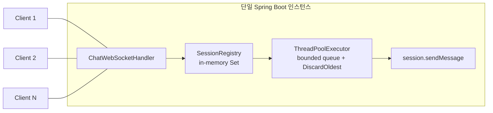
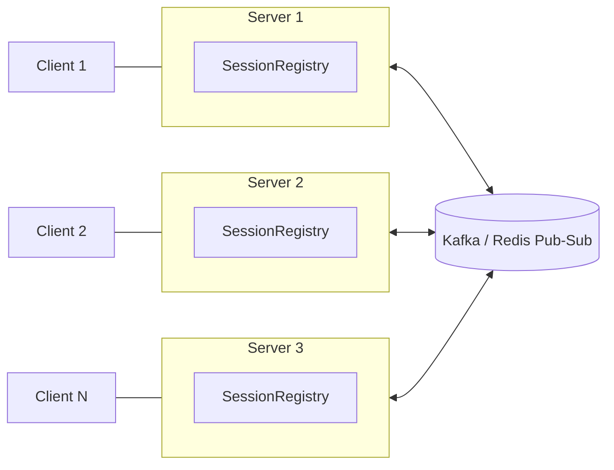

# Real-time Chat Burst Handling Engine

대규모 라이브 방송(스포츠 중계, 라이브 예능 등)에서 채팅 메시지가 폭발적으로 증가하는 상황을 가정하고, 실시간 메시지 fan-out 시스템의 병목을 직접 측정하고 단계적으로 개선하는 프로젝트입니다.

## Engineering Philosophy

Kafka, batching, backpressure 같은 기술을 처음부터 넣지 않습니다. 다음 사이클을 반복합니다.

```
Baseline → Measure → Identify Bottleneck → Hypothesis → Implement → Re-measure → Trade-off 기록
```

## Test Environment

- Java 17, Spring Boot 4.1.1 (Gradle)
- k6 v2.2.0 (로컬)
- Windows 11, 8 core
- 모든 부하 테스트는 로컬(localhost)에서 서버-클라이언트 동시 실행

---

## Stage 0 — Naive WebSocket Broadcast

### Decision
`/chat` 엔드포인트로 들어온 텍스트 메시지를 현재 연결된 모든 세션에 broadcast. 세션 관리는 `SessionRegistry`로 책임 분리, `ConcurrentHashMap.newKeySet()`으로 동시 접속 세션 관리.

### Result
2개 브라우저 탭으로 수동 검증 — 서로 다른 두 연결 사이에서 broadcast가 정확히 동작함을 확인. 메시지 히스토리는 저장하지 않으므로 늦게 접속한 클라이언트는 이전 메시지를 보지 못함 (설계상 의도된 동작, 프로젝트 스코프에서 영속성 제외).

### Next Problem
기능은 동작하지만 동시 부하 상황에서 검증되지 않음.

---

## Stage 1 — 동시 Fan-out 시 발생하는 연결 강제 종료

### Problem
여러 클라이언트가 동시에 메시지를 보내면, 서로 다른 스레드에서 각각 `broadcast()`가 실행되면서 같은 대상 세션에 동시에 `sendMessage()`가 호출되어 연결이 강제로 끊기는 현상 발생.

### Evidence
k6 부하 테스트 (VUS=50, MSG_INTERVAL_MS=500, DURATION=30s):
- `vus`가 43~50 사이에서 요동 (기대값: 50 고정)
- `ws_sessions` 241개 생성 (기대값: 50개, 즉 재연결이 계속 발생)
- 서버 로그에 반복적으로 `java.lang.IllegalStateException: The remote endpoint was in state [TEXT_PARTIAL_WRITING]` 발생

### Hypothesis
`WebSocketSession.sendMessage()`는 동일 세션에 대한 동시 호출에 안전하지 않음. 여러 클라이언트의 메시지 수신이 거의 동시에 발생하면 각각의 `handleTextMessage()` → `broadcast()` 호출이 병렬로 실행되며, 같은 타겟 세션에 대해 동시에 write를 시도하게 됨.

### Solution
`broadcast()` 루프 안에서 `session.sendMessage()` 한 줄만 `synchronized (session)`으로 감쌈 (세션 객체 자체를 락으로 사용하는 fine-grained lock).

### Alternatives
`broadcast()` 메서드 전체에 단일 락 적용(coarse-grained lock) — 서로 무관한 세션 간 전송까지 전부 직렬화되어 병렬성을 완전히 잃으므로 기각. (동일 조건에서 이론상 처리 시간이 N배 늘어남, N=세션 수)

### Trade-off
버그(연결 강제 종료, 재연결 폭주)는 해결했으나, 락 경합으로 인해 end-to-end latency가 상승함.

### Result

| 지표 | 수정 전 | 수정 후 |
|---|---|---|
| vus (연결 유지) | 43~50 (불안정) | 50 (안정) |
| ws_sessions | 241개 | 50개 |
| latency avg | 684µs | 7.16ms |
| latency p95 | 2ms | 16ms |
| IllegalStateException | 반복 발생 | 미발생 |

### Next Problem
락 경합으로 latency가 ~10배 상승. message rate를 점진적으로 올려서 이 상승이 어디까지 버티는지 확인 필요.

---

## Stage 1.5 — Message Rate 계단식 측정 (connection 50개 고정)

### Decision
connection 수는 50개로 고정하고, 메시지 발생 간격(`MSG_INTERVAL_MS`)을 500 → 250 → 100 → 50 → 25 → 10ms로 점진적으로 줄여가며 latency 변화를 측정.

### Evidence

| 간격 | ingress | egress | latency avg | p95 | max | 세션 유지 |
|---|---|---|---|---|---|---|
| 500ms | 98.4/s | 4,920/s | 7.6ms | 16ms | 30ms | 50/50 안정 |
| 250ms (재검증 2회) | 198.3/s | 9,917/s | 7.62ms | 16ms | 30ms | 50/50 안정 |
| 100ms | 498.3/s | 24,915/s | 10.66ms | 28ms | 45ms | 50/50 안정 |
| 50ms | 998.1/s | 49,895/s | 11.17ms | 25ms | 42ms | 50/50 안정 |
| 25ms | 1,996.8/s | 99,791/s | 4.65ms | 11ms | 101ms | 50/50 안정 |
| **10ms** | **3,113.8/s** | **150,996/s** | **1.04~1.6초** | **1.83~2.97초** | **2.94~4.34초** | 50/50 안정 |

(250ms는 최초 측정에서 2.92ms라는 이상치가 나와 2회 재검증함 — 노이즈로 판명. 반복 측정 없이 1회성 결과만 믿으면 안 된다는 걸 확인.)

### Hypothesis
25ms(egress 약 10만/s)까지는 완만하지만, 10ms(egress 약 15만/s) 구간에서 latency가 200배 가까이 폭발하는 절벽(cliff) 형태. 세션은 끊기지 않음 — 단순 크래시가 아니라 처리 지연.

### Additional Evidence — CPU 사용률
10ms 조건 실행 중 Spring Boot 프로세스(8코어) CPU 사용률을 직접 측정: **36~48% 사이에서 등락, 100%에 도달한 적 없음.** 스레드 수는 90개로 일정하게 유지.

### Conclusion
CPU에 여유가 있는데도 latency가 폭발 → 스레드 대부분이 `synchronized(session)` 락을 기다리며 BLOCKED 상태(CPU를 쓰지 않는 대기 상태)에 머물러 있었다는 근거. Producer(메시지 유입)가 Consumer(broadcast 처리)보다 빨라지는 상황을 실측으로 확인함.

### Next Problem
스레드가 락 경합으로 낭비되고 있다면, 유휴 스레드가 다른(안 잠긴) 세션 작업을 가져가서 처리하도록 만들면 개선되지 않을까 — 다음 실험으로 이어짐.

---

## Stage 2 — ExecutorService 기반 병렬 Fan-out 시도 (실패)

### Decision
`broadcast()`에서 세션별 전송을 순차 for-loop 대신, `ExecutorService`(고정 스레드 풀 64개)에 개별 작업(session당 1개)으로 던져서 병렬 처리하도록 변경.

### Hypothesis
한 세션에 대한 락 대기가 다른 세션으로의 전송을 막지 않게 되면, 유휴 스레드 활용도가 높아져 latency가 개선될 것으로 예상.

### Result — 가설 기각

동일 조건(VUS=50, MSG_INTERVAL_MS=10ms)에서 재측정:

| | 수정 전 (동기 순차) | 수정 후 (ExecutorService 병렬) |
|---|---|---|
| latency avg | 1.04~1.6초 | **2.57초** |
| latency p95 | 1.83~2.97초 | **3.9초** |
| latency max | 2.94~4.34초 | **4.88초** |

**오히려 악화됨.**

### Root Cause Analysis
`Executors.newFixedThreadPool()`이 내부적으로 사용하는 큐(`LinkedBlockingQueue`)는 크기 제한이 없음. 수정 전에는 `handleTextMessage()`를 처리하는 스레드가 broadcast 전체를 끝내야 다음 메시지를 받을 수 있었기 때문에, 스레드 개수(~90개)가 "얼마나 많은 미처리 작업이 시스템에 쌓일 수 있는가"를 우연히 제한하는 암묵적 backpressure 역할을 하고 있었음. ExecutorService 도입으로 작업 제출이 non-blocking이 되면서 이 암묵적 제한이 사라졌고, 초당 약 15.8만 건(ingress 3,173/s × 50세션)의 작업이 무제한 큐에 계속 쌓이며 대기시간이 테스트 진행 시간에 비례해 계속 늘어남 (sustained overload 상황에서 unbounded queue는 시간이 지날수록 평균 대기시간이 발산함).

### Alternatives Considered
- 스레드 풀 크기를 늘린다 — 근본 원인(큐 자체가 무제한이라는 것)을 해결하지 못하므로 임시방편으로 판단, 채택하지 않음

### Trade-off
병렬화 자체는 이론적으로 유휴 자원 활용을 높이지만, **backpressure(수용 속도 제한) 없이 병렬성만 높이면 오히려 시스템 전체의 지연이 악화될 수 있다는 것을 실측으로 확인.** 이 변경은 코드베이스에 반영하지 않고(revert), 실패한 시도로만 기록함.

### Additional Finding — 메시지 순서 보장 문제
`synchronized`는 상호 배제만 보장할 뿐 FIFO 순서를 보장하지 않음. 여러 스레드가 같은 세션을 향한 서로 다른 메시지를 병렬로 처리할 경우, 나중에 제출된 작업이 먼저 락을 획득해 먼저 전송될 수 있음 — 클라이언트 입장에서 메시지 순서가 뒤바뀔 수 있는 잠재적 버그. 현재 동기 순차 처리(revert된 버전)에서는 발생하지 않지만, 향후 병렬화를 다시 시도할 경우 반드시 함께 해결해야 함.

### Next Problem
1. 유입 속도를 제한 없이 다 받아주는 대신, 시스템이 감당 가능한 만큼만 받아들이고 나머지는 명시적으로 처리(거부/지연/연결 종료)하는 **backpressure** 설계 필요
2. 세션별 메시지 순서 보장 방법 필요 (병렬화를 다시 시도할 경우)

---

## Stage 3 — Bounded Queue + Backpressure 도입

### Decision
`ThreadPoolExecutor`를 `LinkedBlockingQueue`(무제한) 대신 `ArrayBlockingQueue`(크기 제한) + `DiscardOldestPolicy`로 구성. 큐가 꽉 차면 아직 처리 안 된 것 중 가장 오래된 전송 작업을 버리고 새 작업을 받음 ("느리게 다 보여주기"보다 "최신 것 위주로 보여주기"를 택함 — 라이브 채팅은 오래된 메시지의 가치가 빠르게 떨어진다는 판단).

### Why 이 위치(egress)인가
ingress(들어오는 지점)를 막으면 "메시지 1개→50개로 증폭"되는 구조의 본질을 안 건드리고 타이밍만 늦추는 것. 실제로 부담이 되는 자원(세션별 전송)에 직접 제한을 거는 게 egress임.

### Evidence — 큐 용량별 비교 측정
동일 조건(VUS=50, MSG_INTERVAL_MS=10ms, DURATION=30s)에서 큐 용량만 변경하며 측정. Drop count는 커스텀 `RejectedExecutionHandler`로 직접 계측 (`/stats` 엔드포인트로 노출).

| 큐 용량 | latency avg | p95 | max | dropped | drop rate(추정) |
|---|---|---|---|---|---|
| 20 | 1.84ms | 5ms | 204ms | 5,917,169 | ~74.4% |
| **50** | **30.25ms** | **109ms** | **526ms** | 2,867,219 | ~40.0% |
| 100 | 495.67ms | 1.25초 | 2.04초 | 1,863,152 | ~28.1% |
| 500 | 687.31ms | 1.51초 | 2.17초 | 1,699,645 | ~26.7% |

(drop rate = dropped / (`ws_messages_sent` × 50세션), 근사치)

### Analysis
용량을 20→50→100으로 늘리면 latency는 급격히 악화(1.84ms→30ms→495ms)되는데 drop rate 개선은 완만함(74%→40%→28%). 100→500 구간은 drop rate가 거의 그대로인데 latency만 더 나빠짐 — **100 이상은 순손해.**

Nielsen의 응답시간 기준(~100ms 이하=즉각적으로 체감, ~1초=지연이 뚜렷이 체감)으로 보면, 50은 p95(109ms)·max(526ms) 모두 "즉각적∼약간의 지연" 구간에 머무는 반면 100은 p95가 이미 1.25초로 "명백히 느림" 구간에 진입함.

### Decision — 큐 용량 50 채택
latency가 사람이 체감하기에 즉각적인 수준을 유지하면서, drop rate를 20 대비 절반 가까이 낮추는 지점.

### 이 수치의 한계 (중요)
이 40% drop rate는 "50개 연결이 각자 초당 100건(10ms 간격)"이라는 **인위적인 극한 조건**에서 나온 값이다. 이건 실제 사용자가 타이핑으로 낼 수 있는 속도가 아니라 시스템의 절벽 지점을 찾기 위한 스트레스 테스트 조건이며, 연결 수를 늘리고 개인당 속도를 현실적인 수준으로 낮춘 조건(Stage 4)에서는 drop rate가 달라질 수 있다 — 아직 검증 안 됨.

### 참고 — 유사 업계 패턴
- Reactive Streams / RxJava / Akka Streams의 `DROP`/`LATEST` backpressure 전략
- WebRTC 등 실시간 영상 스트리밍의 jitter buffer (밀리느니 오래된 프레임을 버림)
- SRE의 load shedding (감당 못 할 부하는 일부러 버려서 전체 시스템 붕괴를 막음)

고정된 "정답 비율"은 없고, 목표 latency(SLO)를 먼저 정하고 그걸 만족하는 선에서 버퍼 크기를 정하는 게 일반적 접근 — 이번 실험이 그 방법론 그대로.

### Next Problem
1. Connection 수를 現실적인 규모로 늘리면서 개인당 메시지 속도는 낮추는 축(Stage 4)을 아직 측정 안 함 — 실제 TVING 트래픽 패턴에 더 가까운 조건
2. Stage 2에서 발견한 메시지 순서 보장 문제는 여전히 미해결 (현재는 순차 처리라 발생 안 하지만, 향후 병렬화 시 재발 가능)

---

## Stage 4 — Connection 수 축 측정 (부분 완료)

### Decision
Message rate는 사람이 타이핑 가능한 현실적인 속도(2초 간격)로 고정하고, connection 수를 100 → 300으로 늘리며 측정. 지금까지는 "50명이 비정상적으로 빠르게 보내는" 축만 봤는데, 실제 라이브 방송은 "훨씬 많은 사람이 각자는 느리게 보내는" 형태에 가까움 — fan-out 구조상 connection 수(N)가 늘면 egress는 N²에 비례해 커지므로, 이 축이 오히려 더 중요할 수 있다는 가설.

### Evidence — VUS=100 (MSG_INTERVAL_MS=2000, DURATION=30s)

| latency avg | p95 | max | dropped |
|---|---|---|---|
| 15.33ms | 46ms | 104ms | 123,270 |

세션 100개 안정적으로 유지, 서버 로그 클린. 여전히 체감상 즉각적인 수준.

### Evidence — VUS=300 (동일 조건) — 이상 신호 발견, 원인은 서버가 아님

k6 리포트상 `ws_sessions=1,036`(기대값 300), `736 complete + 300 interrupted iterations` — 연결이 계속 재생성되는 것처럼 보임.

**서버 로그로 직접 검증**: `session registered` 카운트가 정확히 300건(순증)으로 깨끗하고, `exception`/`warn` 로그 0건. **즉 서버는 정상 동작했고, 이상 신호는 클라이언트(k6)와 서버를 같은 로컬 머신에서 동시 실행하는 테스트 환경 자체의 한계(Windows 임시 포트/소켓 제약 추정)로 판단.**

### Conclusion
VUS 300 이상에서는 "서버의 한계"인지 "로컬 단일 머신에서 부하생성기+서버를 같이 돌리는 테스트 환경의 한계"인지 구분이 안 되므로, **이 지점에서 로컬 측정을 중단.** 이 이상의 connection 수를 신뢰성 있게 측정하려면 k6를 별도 머신(또는 클라우드)에서 실행해 서버와 물리적으로 분리해야 함 — 실무에서 부하 테스트를 별도 인프라로 분리해서 하는 이유를 직접 체감함.

### Next Problem
- k6를 별도 머신/클라우드에서 실행하는 분리된 부하 테스트 환경 구축 필요 (다음 세션 과제)
- VUS 500~수천 규모의 실제 서버 한계는 아직 미검증

### 장기 아키텍처 방향 — 단일 서버의 한계

지금 구조는 **단일 JVM 프로세스의 메모리(`Set<WebSocketSession>`)에 모든 세션을 들고 있는 구조**라, 서버 한 대의 한계를 넘어서는 동시접속을 감당할 수 없다. 여러 서버로 수평 확장하려면, 서버 A에 붙은 클라이언트가 보낸 메시지를 서버 B/C에 붙은 클라이언트에게도 전달할 방법이 필요하다 — 이게 Kafka/Redis 같은 pub-sub 계층이 필요해지는 지점이다.

**현재 (단일 노드):**


**향후 (수평 확장, pub-sub 도입 후 — 아직 미구현):**


이 방향은 **아직 측정된 문제가 없어서 구현하지 않는다** — 이 프로젝트의 원칙("측정된 문제가 있을 때만 기술 도입")을 그대로 유지. Stage 4에서 단일 서버의 connection 한계를 실측으로 확인하면, 그때 이 확장을 근거를 갖고 시작한다.

### 정리 — 아직 안 한 것들
- 세션별 메시지 순서 보장 (Stage 2에서 발견, 미해결)
- Connection 수 축 부하 테스트 (Stage 4)
- 다중 서버 확장을 위한 pub-sub 계층 (Kafka/Redis) — Stage 4 결과에 따라 필요성 재검토
- 메시지 우선순위(공지/후원 등)에 따른 차등 delivery 정책 — 아직 근거 없음, Stage 6 원안
